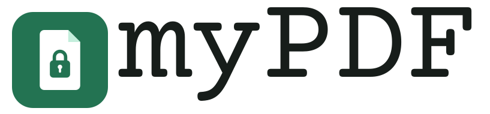

# myPDF

https://mypdf.gachichio.org

Edit any PDF. It never leaves your device. A browser-only PDF editor built on MuPDF.js: view, organise, split and merge, crop, annotate, add styled text, edit words, fill forms, sign (drawn, typed in a script font, initials, date, and a certificate signature that other readers can check), redact (with ready-made patterns, verified), compress, OCR, protect, save pages as pictures or text, and export to Word. Free software under AGPL-3.0-or-later.

Made with ❤️ by [Brian Gachichio](https://x.com/b_gachichio). Support: [Paystack](https://paystack.shop/pay/gachichio) or Bitcoin via Lightning (`gachichio@walletofsatoshi.com`) or on-chain (`bc1ptrd8ykgu046nkwjml4kvtke0vz6ga0cmhccmgkpspwuswrasjspqq6yfu6`).

## Run
`npm ci && npm run dev`. Full steps are in `DEPLOY.md` section 4.

## Test
`npm test` (unit), `npx playwright test` (end to end, one spec per requirement). `BASE_URL=https://mypdf.gachichio.org npx playwright test` runs the suite against production.

## Roll back
`./rollback.sh <deployment-url>`. Details are in `DEPLOY.md` section 8.
